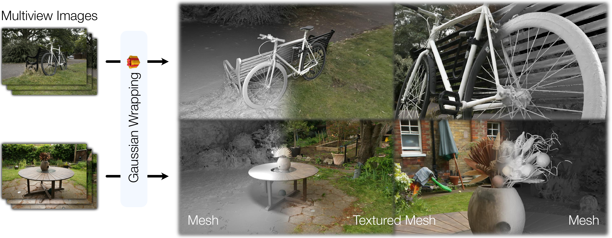

<div align="center">

<h1>From Blobs to Spokes: High-Fidelity Surface Reconstruction via Oriented Gaussians</h1>

<font size="4">
<a href="https://diego1401.github.io">Diego Gomez*<sup>1</sup></a>&emsp;
<a href="https://anttwo.github.io/">Antoine Guédon*<sup>1</sup></a>&emsp;
<a href="https://nissmar.github.io/">Nissim Maruani<sup>1,2</sup></a>&emsp;
<a href="https://s2.hk/">Bingchen Gong<sup>1</sup></a>&emsp;
<a href="https://www.lix.polytechnique.fr/~maks/">Maks Ovsjanikov<sup>1</sup></a>
</font>

<br>

<font size="3">
<sup>1</sup>Ecole Polytechnique, France &nbsp;&nbsp;
<sup>2</sup>Inria, Université Côte d'Azur, France
</font>

<br>

<font size="2">* Equal contribution</font>

<br>

[Project Page](https://diego1401.github.io/BlobsToSpokesWebsite/) | [arXiv](#) <!-- placeholder -->

<br>



</div>

**Gaussian Wrapping** reconstructs watertight, textured surface meshes of full 3D scenes—including extremely thin structures such as bicycle spokes—at a fraction of the mesh size of concurrent works, by interpreting 3D Gaussians as stochastic oriented surface elements.


## Installation

```bash
conda create -n gaussian_wrapping python=3.10 -y
conda activate gaussian_wrapping

# Set CUDA paths (adjust version as needed)
export CPATH=/usr/local/cuda-11.8/targets/x86_64-linux/include:$CPATH
export LD_LIBRARY_PATH=/usr/local/cuda-11.8/targets/x86_64-linux/lib:$LD_LIBRARY_PATH
export PATH=/usr/local/cuda-11.8/bin:$PATH

python install.py --cuda_version 11.8   # or 12.1
```


## Training & Mesh Extraction

Gaussian Wrapping expects a **COLMAP-formatted dataset** (images + sparse reconstruction).
Use `-s` for the dataset root and `-m` for the output directory.

We provide two end-to-end scripts that run training followed by mesh extraction:

```bash
# Our median-depth rasterizer (faster, better metrics)
python gaussian_wrapping/scripts/train_and_extract_gw_ours.py \
    -s <PATH_TO_COLMAP_DATASET> \
    -m <OUTPUT_DIR> \
    --imp_metric <outdoor|indoor> \
    -r 2

# RaDeGS rasterizer (smoother-looking meshes)
python gaussian_wrapping/scripts/train_and_extract_gw_radegs.py \
    -s <PATH_TO_COLMAP_DATASET> \
    -m <OUTPUT_DIR> \
    --imp_metric <outdoor|indoor> \
    -r 2
```

Each script runs three steps in sequence: training, mesh extraction, and texture refinement. The refined mesh is saved alongside the extracted mesh with a `_texture_refined` suffix.

### Key options

| Flag | Description |
|------|-------------|
| `--imp_metric` | Scene type: `outdoor` or `indoor` |
| `-r 2` | Downsample input images by 2× (used for metrics and comparisons) |

## Primal Adaptive Meshing

An alternative mesh extraction method that samples candidate points from an existing mesh (e.g. extracted by the standard pipeline), refines them onto the Gaussian occupancy isosurface via gradient descent, and reconstructs the surface with a Delaunay-based approach.

```bash
python gaussian_wrapping/primal_adaptive_meshing_extraction.py \
    -s <PATH_TO_COLMAP_DATASET> \
    -m <OUTPUT_DIR> \
    --input_mesh <PATH_TO_INPUT_MESH> \
    --output_mesh <PATH_TO_OUTPUT_MESH.ply> \
    --max_points <NUMBER_OF_MESH_VERTICES>
```

| Flag | Default | Description |
|------|---------|-------------|
| `--input_mesh` | required | Input mesh to sample candidate points from (`.ply` / `.obj`) |
| `--output_mesh` | required | Output mesh path (must end in `.ply`) |
| `--max_points` | `1e6` | Number of candidate points to sample from the input mesh |
| `--bounding_box_method` | `scene` | `scene` uses the camera extent; `ground_truth` uses the TNT ground truth volume (if available)|
| `--bounding_box_scaling` | `1.0` | Scale factor applied to the scene bounding box |

<details>
<summary><strong>Advanced options</strong></summary>

| Flag | Default | Description |
|------|---------|-------------|
| `--n_steps` | `10` | Number of refinement steps |
| `--vacancy_threshold` | `0.1` | Points with vacancy further than this from 0.5 are filtered out |
| `--mesh_sampling_method` | `proportional_to_camera` | `proportional_to_camera` weights sampling by proximity to cameras; `surface_even` samples uniformly on the cropped section of the input mesh.|
| `--p_per_tet` | `10` | Points sampled per tetrahedron for occupancy estimation |
| `--oversampling_factor` | `2` | Mostly useful when `max_points` is small. Sample this multiple of `max_points` upfront per pass to reduce the number of expensive occupancy evaluations |
| `--post_process` | off | Apply post-processing to the output mesh |
| `--save_candidate_points` | off | Save the refined candidate point cloud alongside the mesh |
| `--plot_vacancy_histogram` | off | Save per-step vacancy histograms to the output directory |

</details>

---

## Benchmarks

### Tanks and Temples
<details>
To reproduce our full Tanks and Temples results, run the end-to-end benchmark scripts from the project root. Each script trains all 6 scenes, extracts meshes, and runs all three evaluations (uniform sampling, virtual scan sampling, and legacy TNT).

```bash
# Ours rasterizer
python gaussian_wrapping/scripts/benchmark_tnt_gw_ours.py \
    --data_dir <PATH_TO_TNT_SCENES> \
    --gt_dir <PATH_TO_TNT_GT> \
    --output_dir <OUTPUT_DIR>

# RaDeGS rasterizer
python gaussian_wrapping/scripts/benchmark_tnt_gw_radegs.py \
    --data_dir <PATH_TO_TNT_SCENES> \
    --gt_dir <PATH_TO_TNT_GT> \
    --output_dir <OUTPUT_DIR>
```

`<PATH_TO_TNT_SCENES>` should contain one subdirectory per scene (`Barn/`, `Caterpillar/`, etc.) in COLMAP format. `<PATH_TO_TNT_GT>` should contain the ground truth files for each scene (`<Scene>.ply`, `<Scene>.json`, `<Scene>_trans.txt`, `<Scene>_COLMAP_SfM.log`).

| Flag | Default | Description |
|------|---------|-------------|
| `--gpu_device` | `0` | CUDA device index |
| `--data_on_gpu` | off | Load dataset on GPU instead of CPU |
| `--depth_order` | off | Enable depth-order regularization (see note below) |
| `--depth_order_config` | — | Config name under `configs/depth_order/` (e.g. `default`, `strong`); only used with `--depth_order` |

> **Note on `--depth_order`:** This flag enables depth-order regularization using a pre-trained monocular depth model. It is **not used in the paper**, but can yield better results. It requires monocular depth priors to be pre-computed.

Per-scene results are written to `<OUTPUT_DIR>/<Scene>/`, with evaluation outputs in `eval_uniform/`, `eval_virtual_scan/`, and `eval_legacy/` subdirectories.

<details>
<summary><strong>Uniform and Virtual Scan Sampling Evaluations</strong></summary>

We provide evaluation scripts using two sampling strategies: **uniform sampling** and **virtual scan sampling**. Full documentation and the standalone toolbox are available at [diego1401/TNTUniScanEvals](https://github.com/diego1401/TNTUniScanEvals.git).

The scripts live under `gaussian_wrapping/eval/TNTUniScanEvals/`. See that directory's [README](gaussian_wrapping/eval/TNTUniScanEvals/README.md) for dataset setup and installation instructions.

#### Uniform Sampling Evaluation

Evaluates a mesh or point cloud against the ground truth using surface-based sampling and a 3-step ICP alignment pipeline.

```bash
python gaussian_wrapping/eval/TNTUniScanEvals/uniform_sampling_eval.py \
    --dataset-dir <path/to/scene_dir> \
    --traj-path <path/to/scene_dir>/<Scene>_COLMAP_SfM.log \
    --ply-path <path/to/mesh.ply> \
    --out-dir <output_dir>
```

#### Virtual Scan Sampling Evaluation

Evaluates a mesh by rendering depth from each training camera and projecting to world-space point clouds. Requires a COLMAP dataset and a CUDA-enabled GPU.

```bash
python gaussian_wrapping/eval/TNTUniScanEvals/virtual_scan_sampling_eval.py \
    -s <path/to/colmap_dataset> \
    -r 2 \
    --dataset-dir <path/to/scene_dir> \
    --traj-path <path/to/scene_dir>/<Scene>_COLMAP_SfM.log \
    --ply-path <path/to/mesh.ply> \
    --out-dir <output_dir>
```

Both scripts output **precision**, **recall**, and **F-score** to the console, along with precision/recall curve plots. Pass `--save_point_clouds` to also write color-coded error clouds.

</details>
</details>

### DTU

<details>
Coming soon.
</details>

### MipNeRF360

<details>
To reproduce our full MipNeRF 360 results, run the end-to-end benchmark scripts from the project root. Each script trains all 7 scenes, extracts meshes, and evaluates novel view synthesis quality.

```bash
# Ours rasterizer
python gaussian_wrapping/scripts/benchmark_mip360_gw_ours.py \
    --data_dir <PATH_TO_MIP360_SCENES> \
    --output_dir <OUTPUT_DIR>

# RaDeGS rasterizer
python gaussian_wrapping/scripts/benchmark_mip360_gw_radegs.py \
    --data_dir <PATH_TO_MIP360_SCENES> \
    --output_dir <OUTPUT_DIR>
```

`<PATH_TO_MIP360_SCENES>` should contain one subdirectory per scene (`bicycle/`, `bonsai/`, `counter/`, `garden/`, `kitchen/`, `room/`, `stump/`) in COLMAP format.

| Flag | Default | Description |
|------|---------|-------------|
| `--gpu_device` | `0` | CUDA device index |
| `--data_on_gpu` | off | Load dataset on GPU instead of CPU |
| `--depth_order` | off | Enable depth-order regularization (see note below) |
| `--depth_order_config` | — | Config name under `configs/depth_order/` (e.g. `default`, `strong`); only used with `--depth_order` |

> **Note on `--depth_order`:** This flag enables depth-order regularization using a pre-trained monocular depth model. It is **not used in the paper**, but can yield better results. It requires monocular depth priors to be pre-computed.

Per-scene results are written to `<OUTPUT_DIR>/<scene>/`. Rendered images and metrics (PSNR / SSIM / LPIPS) are saved in the standard Gaussian Splatting output structure.
</details>

### Mesh-Based Novel View Synthesis

We evaluate mesh-based novel view synthesis on the MipNeRF360 and Tanks and Temples datasets. Use the training and mesh extraction scripts described above to produce meshes for these datasets, then refer to [MILo](https://github.com/Anttwo/MILo.git) for the evaluation pipeline.

## Citation

```bibtex
@article{gomez2026gaussianwrapping,
  title={From Blobs to Spokes: High-Fidelity Surface Reconstruction via Oriented Gaussians},
  author={Gomez, Diego and Gu{\'e}don, Antoine and Maruani, Nissim and Gong, Bingchen and Ovsjanikov, Maks},
  journal={arXiv preprint arXiv:TODO_ARXIV_ID},
  year={2026}
}
```
